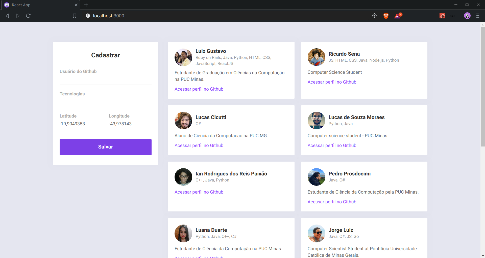
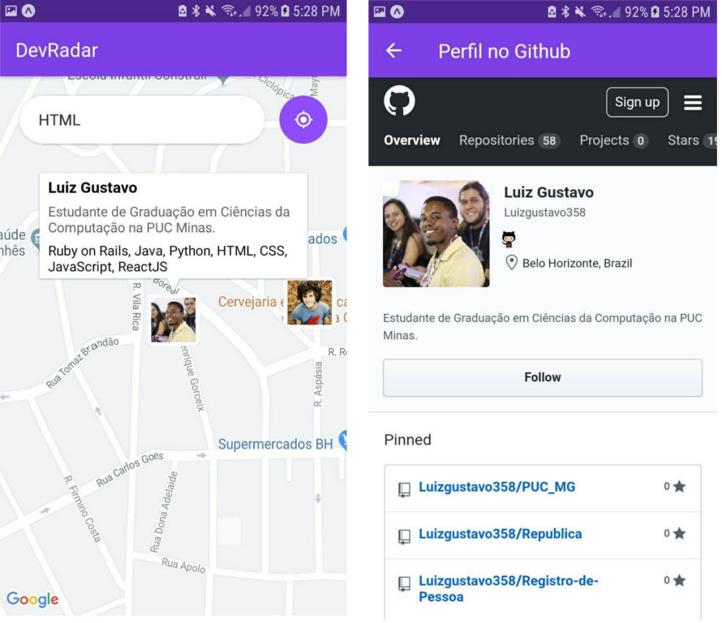

# DevRadar

### Sobre:

Aplicativo e Aplicação Web para cadastro de Devs.

### Como rodar

- Rodar o backend com: 

```sh
cd backend
yarn dev
```

- Rodar o web:

```sh
cd web
yarn start
```

- Rodar o Aplicativo Mobile:

```sh
cd mobile
yarn start
```

### Curso:

Semana Omnistack do site [RocketSeat](https://rocketseat.com.br/), ministrado por [Diego Fernandes](https://github.com/diego3g).

### Imagens:

- Web



- Mobile



### O que usei:

- [Node.js](https://nodejs.org/en/)
- [Yarn](https://yarnpkg.com/lang/en/)
- [Expo](https://expo.io/)
- [ReactJS](https://pt-br.reactjs.org/)
- [React Native](https://facebook.github.io/react-native/)
- [VisualCode](https://code.visualstudio.com/)
- [MongoDB](https://www.mongodb.com/)
